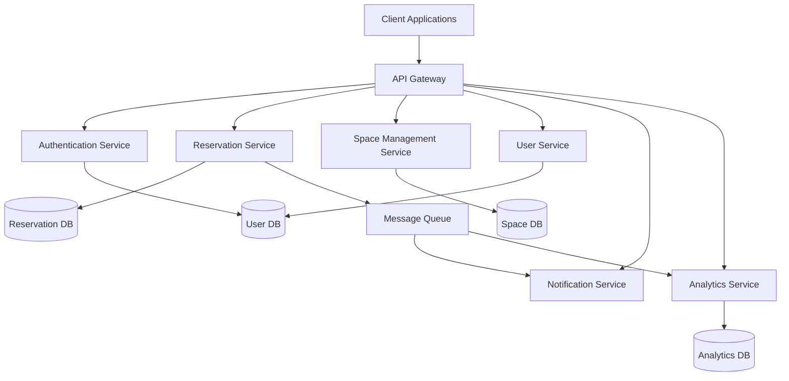
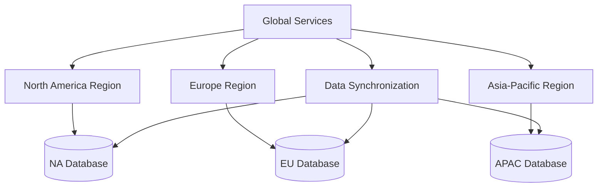
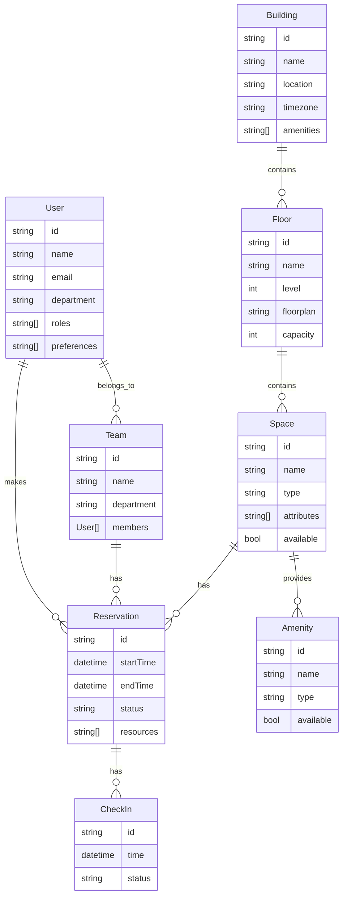

# Global Seat Reservation System: Technical Design

## System Architecture Overview

### High-Level Architecture



The system follows a microservices architecture with the following key components:

1. **Client Applications**
   - Web application (responsive)
   - Mobile applications (iOS/Android)
   - Calendar integrations

2. **API Gateway**
   - Single entry point for all client requests
   - Request routing
   - Load balancing
   - Authentication verification
   - Rate limiting

3. **Core Services**
   - Authentication Service
   - Reservation Service
   - Space Management Service
   - User Service
   - Notification Service
   - Analytics Service

4. **Data Stores**
   - Distributed databases with regional replication
   - Caching layer for frequently accessed data
   - Data partitioning strategy for global scale

5. **Message Queue**
   - Asynchronous communication between services
   - Event-driven architecture for real-time updates
   - Reliable delivery of notifications and analytics events

### Regional Deployment Strategy



- **Regional Clusters**: Services deployed in multiple geographic regions
- **Data Sovereignty**: Regional data storage for compliance with local regulations
- **Global Services**: Centralized services for cross-region functionality
- **Data Synchronization**: Replication of essential data across regions
- **Failover Strategy**: Regional redundancy for high availability

## Technology Stack

### Frontend Technologies

- **Web Application**
  - Framework: React with TypeScript
  - State Management: Redux
  - UI Components: Material-UI
  - Maps/Floorplans: SVG with interactive elements
  - Responsive Design: CSS Grid and Flexbox
  - Accessibility: WCAG 2.1 AA compliant

- **Mobile Applications**
  - Cross-platform: React Native
  - Native Components: For performance-critical features
  - Offline Support: Local storage with sync
  - Push Notifications: Firebase Cloud Messaging

### Backend Technologies

- **API Layer**
  - RESTful APIs with OpenAPI specification
  - GraphQL for complex data queries
  - API Gateway: Kong or AWS API Gateway

- **Microservices**
  - Language: Node.js with TypeScript
  - Framework: NestJS
  - Authentication: OAuth 2.0 with JWT
  - Service Discovery: Kubernetes/Consul

- **Databases**
  - Primary Database: PostgreSQL (with TimescaleDB for time-series data)
  - Caching: Redis
  - Search: Elasticsearch
  - Analytics: ClickHouse

- **Infrastructure**
  - Containerization: Docker
  - Orchestration: Kubernetes
  - CI/CD: GitHub Actions
  - Infrastructure as Code: Terraform
  - Monitoring: Prometheus and Grafana

### Integration Technologies

- **Calendar Integration**
  - Microsoft Graph API for Outlook
  - Google Calendar API
  - iCalendar standard for interoperability

- **Directory Services**
  - LDAP/Active Directory integration
  - SCIM for user provisioning

- **IoT Integration**
  - MQTT for sensor communication
  - Edge computing for local processing
  - Sensor data aggregation and analysis

## Data Model

### Core Entities



### Data Access Patterns

- **User Queries**
  - Find available spaces by location, time, and attributes
  - View personal reservation history and upcoming reservations
  - Check team member locations and availability

- **Admin Queries**
  - View occupancy rates by building, floor, or space type
  - Track no-show rates and cancellation patterns
  - Monitor space utilization trends over time

- **System Queries**
  - Validate reservation conflicts
  - Process check-in/check-out events
  - Generate notifications for upcoming reservations

## API Design

### Core API Endpoints

#### Reservation Service

```
GET    /reservations                # List reservations (with filters)
POST   /reservations                # Create a new reservation
GET    /reservations/{id}           # Get reservation details
PUT    /reservations/{id}           # Update a reservation
DELETE /reservations/{id}           # Cancel a reservation
POST   /reservations/{id}/checkin   # Check in to a reservation
POST   /reservations/{id}/checkout  # Check out from a reservation
GET    /reservations/available      # Find available spaces (with filters)
```

#### Space Management Service

```
GET    /buildings                   # List buildings
GET    /buildings/{id}              # Get building details
GET    /buildings/{id}/floors       # List floors in a building
GET    /floors/{id}                 # Get floor details
GET    /floors/{id}/spaces          # List spaces on a floor
GET    /spaces/{id}                 # Get space details
PUT    /spaces/{id}                 # Update space details
GET    /spaces/types                # List space types
GET    /amenities                   # List amenities
```

#### User Service

```
GET    /users                       # List users (admin only)
GET    /users/{id}                  # Get user details
PUT    /users/{id}                  # Update user details
GET    /users/{id}/reservations     # Get user's reservations
GET    /teams                       # List teams
GET    /teams/{id}                  # Get team details
GET    /teams/{id}/members          # List team members
GET    /teams/{id}/reservations     # Get team reservations
```

#### Analytics Service

```
GET    /analytics/utilization       # Get utilization metrics
GET    /analytics/trends            # Get trend analysis
GET    /analytics/reports           # Generate reports
GET    /analytics/dashboard/{role}  # Get role-specific dashboard data
```

### API Security

- **Authentication**: OAuth 2.0 with JWT tokens
- **Authorization**: Role-based access control (RBAC)
- **Rate Limiting**: Prevent abuse and ensure fair usage
- **Input Validation**: Strict validation of all input parameters
- **Output Sanitization**: Prevent data leakage and exposure

## Security Design

### Authentication and Authorization

- **Single Sign-On**: Integration with corporate identity providers
- **Multi-Factor Authentication**: For administrative access
- **Role-Based Access Control**: Granular permissions based on user roles
- **API Security**: OAuth 2.0 with short-lived tokens
- **Session Management**: Secure session handling with proper timeout

### Data Security

- **Encryption at Rest**: All databases encrypted
- **Encryption in Transit**: TLS 1.3 for all communications
- **Data Masking**: Sensitive data masked in logs and analytics
- **Data Classification**: Information classified by sensitivity
- **Data Retention**: Policies aligned with legal requirements

### Compliance

- **GDPR Compliance**: Data subject rights, consent management
- **CCPA Compliance**: Privacy controls and disclosure
- **Audit Logging**: Comprehensive logging of all security events
- **Penetration Testing**: Regular security assessments
- **Vulnerability Management**: Continuous scanning and remediation

## Scalability and Performance

### Scalability Strategy

- **Horizontal Scaling**: Add instances based on load
- **Database Sharding**: Partition data by region and time
- **Caching Strategy**: Multi-level caching for frequently accessed data
- **Stateless Services**: Enable easy scaling of application tier
- **Load Balancing**: Distribute traffic across service instances

### Performance Optimization

- **Query Optimization**: Efficient database queries and indexes
- **Connection Pooling**: Reuse database connections
- **Asynchronous Processing**: Non-blocking operations for I/O
- **Content Delivery Network**: Distribute static assets globally
- **Lazy Loading**: Load data only when needed

### Capacity Planning

- **Peak Load Handling**: Monday morning booking surge (up to 10,000 concurrent users)
- **Regional Capacity**: Sized according to employee distribution
- **Growth Projections**: Accommodate 20% annual growth
- **Resource Allocation**: Auto-scaling based on demand patterns
- **Disaster Recovery**: Capacity for regional failover

## Monitoring and Observability

### Monitoring Strategy

- **Service Health**: Uptime and availability monitoring
- **Performance Metrics**: Response times and throughput
- **Resource Utilization**: CPU, memory, disk, network
- **Business Metrics**: Reservation rates, utilization, no-shows
- **User Experience**: Client-side performance and errors

### Logging and Tracing

- **Centralized Logging**: Aggregate logs from all services
- **Distributed Tracing**: Track requests across services
- **Error Tracking**: Capture and alert on application errors
- **Audit Logging**: Record security and compliance events
- **Log Retention**: Policies aligned with compliance requirements

### Alerting

- **Alert Thresholds**: Based on SLAs and performance baselines
- **Notification Channels**: Email, SMS, chat integrations
- **Escalation Policies**: Tiered response based on severity
- **On-Call Rotation**: Follow-the-sun model for 24/7 coverage
- **Alert Correlation**: Reduce noise by grouping related alerts

## Deployment and DevOps

### CI/CD Pipeline

- **Source Control**: Git with feature branch workflow
- **Continuous Integration**: Automated testing on commit
- **Continuous Deployment**: Automated deployment to staging
- **Deployment Approval**: Manual approval for production
- **Rollback Capability**: Quick reversion to previous versions

### Environment Strategy

- **Development**: For active development work
- **Testing**: For automated and manual testing
- **Staging**: Production-like environment for final validation
- **Production**: Regional production environments
- **Disaster Recovery**: Standby environment for failover

### Release Management

- **Versioning**: Semantic versioning for all components
- **Change Management**: Documented approval process
- **Release Notes**: Comprehensive documentation of changes
- **Feature Flags**: Gradual rollout of new features
- **A/B Testing**: Validate changes with subset of users

## Implementation Roadmap

### Phase 1: Core Functionality (Months 1-3)

1. **Week 1-2**: Project setup and architecture finalization
2. **Week 3-4**: Core data model and database implementation
3. **Week 5-6**: Basic API implementation for reservation management
4. **Week 7-8**: Web application with essential booking features
5. **Week 9-10**: Integration with company directory and SSO
6. **Week 11-12**: Testing and deployment to initial locations

### Phase 2: Global Expansion (Months 4-9)

1. **Month 4**: Mobile application development
2. **Month 5**: Advanced booking rules implementation
3. **Month 6**: Calendar system integration
4. **Month 7**: Enhanced reporting and analytics
5. **Month 8**: Regional deployment preparation
6. **Month 9**: Rollout to all 115 buildings

### Phase 3: Advanced Features (Months 10-18)

1. **Month 10-11**: IoT integration framework
2. **Month 12-13**: AI-powered recommendations
3. **Month 14-15**: Team collaboration features
4. **Month 16-17**: Comprehensive analytics dashboard
5. **Month 18**: Self-service administration tools

## Appendices

### Glossary of Terms

- **Hotelling**: Flexible workspace arrangement where employees don't have assigned desks
- **Check-in**: Process of confirming arrival for a reservation
- **No-show**: When a user fails to check in for their reservation
- **Waitlist**: Queue for users wanting a space that is currently reserved
- **Neighborhood**: Designated area for specific teams or departments

### Reference Architecture Diagrams

- Detailed network architecture
- Security architecture
- Data flow diagrams
- Integration architecture
- Deployment architecture

### Performance Benchmarks

- Target response times for key operations
- Throughput requirements for peak periods
- Scalability testing results
- Load testing methodology
- Performance optimization recommendations

---
*This technical design document provides a comprehensive blueprint for implementing the Global Seat Reservation System. It should be updated as technical decisions evolve during implementation.*
