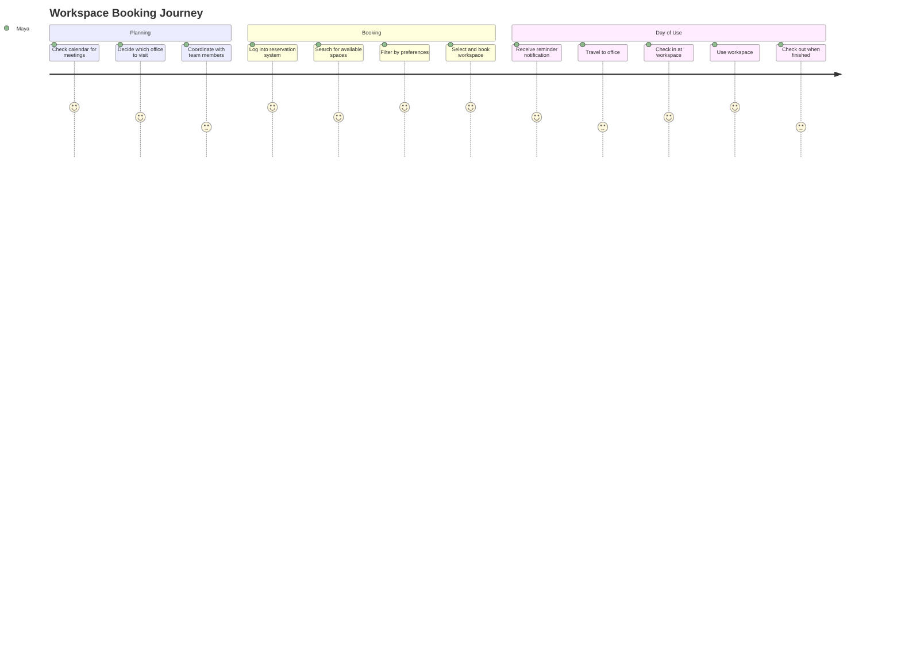
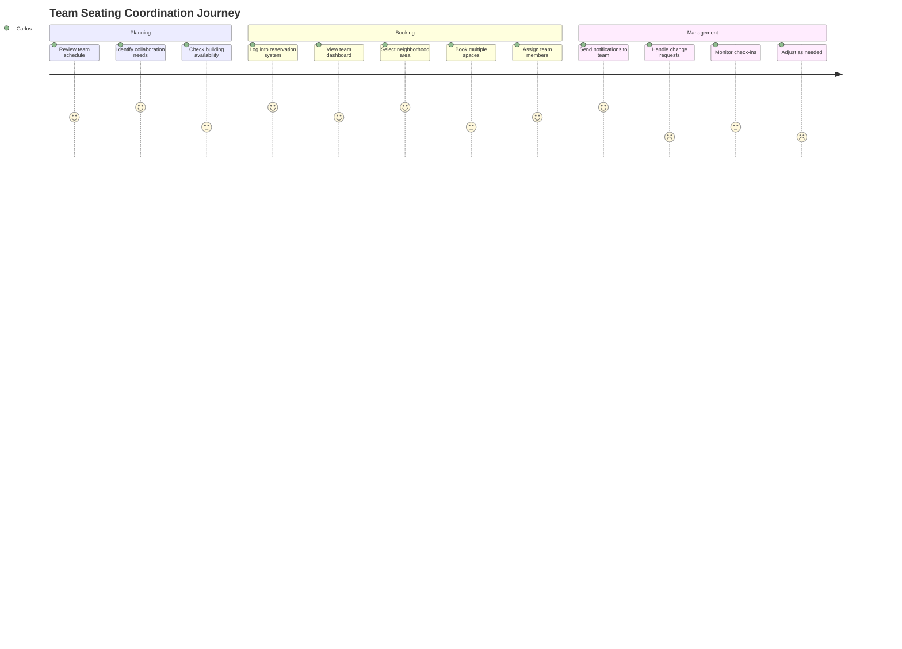
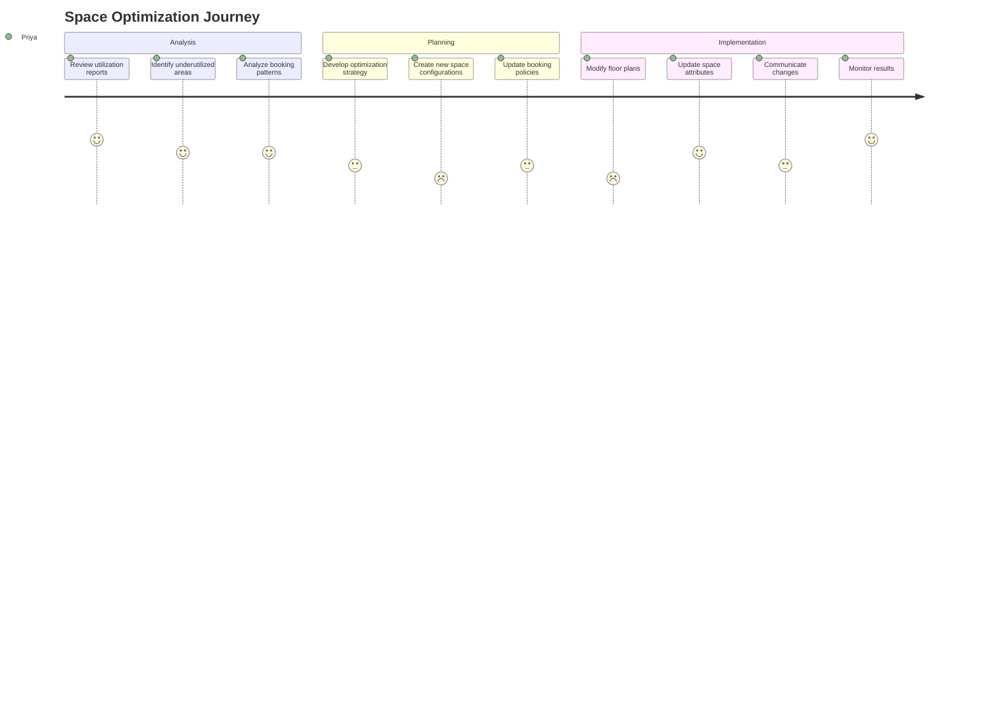

# Global Seat Reservation System: UX Design

## User Experience Vision

The Global Seat Reservation System aims to provide a seamless, intuitive experience that empowers employees to efficiently find and book appropriate workspaces while giving administrators the tools to optimize space utilization. The design prioritizes simplicity, accessibility, and contextual relevance across all interfaces.

## User Research Insights

### Key User Needs

1. **Employees**
   - Quick booking of preferred spaces
   - Visibility of team members' locations
   - Flexible scheduling options
   - Minimal friction in daily workflows

2. **Team Leaders**
   - Coordination of team seating arrangements
   - Visibility of team attendance patterns
   - Ability to book spaces on behalf of team members
   - Insights into team space utilization

3. **Space Administrators**
   - Efficient management of space configurations
   - Clear visibility of utilization patterns
   - Tools to optimize space allocation
   - Ability to implement booking policies

4. **System Administrators**
   - Comprehensive system configuration
   - User management and permissions
   - Integration with other enterprise systems
   - Monitoring and troubleshooting tools

5. **Executive Leadership**
   - High-level utilization insights
   - Cost optimization opportunities
   - Compliance and policy enforcement
   - Strategic planning data

### User Pain Points

1. **Finding Available Spaces**
   - Difficulty locating suitable spaces in unfamiliar buildings
   - Uncertainty about amenities and equipment
   - Frustration when preferred spaces are unavailable

2. **Coordination with Teams**
   - Challenges in coordinating seating with team members
   - Lack of visibility into colleagues' locations
   - Difficulty planning collaborative sessions

3. **Managing Changes**
   - Friction in modifying or canceling reservations
   - Uncertainty about check-in/check-out procedures
   - Handling unexpected absences or schedule changes

4. **Administrative Burden**
   - Manual processes for space management
   - Limited insights into utilization patterns
   - Difficulty enforcing policies consistently

## User Personas

### Maya - Regular Employee
- **Role**: Marketing Specialist
- **Age**: 32
- **Tech Comfort**: High
- **Work Style**: Hybrid (3 days in office, 2 days remote)
- **Goals**: 
  - Find quiet spaces for focused work
  - Coordinate days in office with team members
  - Book meeting rooms for client presentations
- **Frustrations**: 
  - Wasting time looking for available desks
  - Arriving to find reserved space is unsuitable
  - Disconnection from team when working flexibly

### Carlos - Team Leader
- **Role**: Engineering Manager
- **Age**: 41
- **Tech Comfort**: Medium
- **Work Style**: Primarily in-office with occasional remote days
- **Goals**: 
  - Ensure team has appropriate spaces for collaboration
  - Maintain team cohesion with flexible schedules
  - Track attendance patterns for team planning
- **Frustrations**: 
  - Difficulty coordinating team seating
  - Limited visibility into team's workspace usage
  - Managing space for visiting team members

### Priya - Space Administrator
- **Role**: Facilities Coordinator
- **Age**: 36
- **Tech Comfort**: Medium
- **Work Style**: In-office
- **Goals**: 
  - Optimize space utilization
  - Implement consistent booking policies
  - Respond quickly to changing space needs
- **Frustrations**: 
  - Manual processes for space management
  - Limited data for decision-making
  - Balancing different department needs

### Tomas - System Administrator
- **Role**: IT Operations Manager
- **Age**: 45
- **Tech Comfort**: Very High
- **Work Style**: Hybrid
- **Goals**: 
  - Ensure system reliability and performance
  - Integrate with enterprise systems
  - Support global rollout and maintenance
- **Frustrations**: 
  - Managing complex integrations
  - Supporting users across time zones
  - Balancing security with usability

## User Journeys

### Employee Booking a Workspace

### Team Leader Coordinating Team Seating

### Space Administrator Optimizing Utilization

## Interface Design

### Web Application

#### Dashboard (Employee View)

**Key Elements:**
1. **Quick Actions Bar**
   - Book a workspace
   - View my reservations
   - Find a colleague
   - Report an issue

2. **Upcoming Reservations**
   - Today's reservation with check-in button
   - Next 7 days' reservations
   - Quick actions (modify, cancel)

3. **Team Location**
   - Where team members are working today
   - Upcoming team events
   - Team booking patterns

4. **Favorites and Recents**
   - Frequently booked spaces
   - Recently used buildings
   - Saved searches

5. **Notifications and Alerts**
   - Reservation confirmations
   - Check-in reminders
   - Policy updates
   - Waitlist status

#### Space Search and Booking

**Key Elements:**
1. **Search Filters**
   - Date and time range
   - Building/floor/zone
   - Space type
   - Required amenities
   - Proximity to team members

2. **Results Display**
   - List view with key details
   - Map/floor plan view
   - Availability indicators
   - Quick booking actions

3. **Space Details**
   - Photos and descriptions
   - Available amenities
   - Nearby resources
   - Availability calendar
   - Similar alternatives

4. **Booking Confirmation**
   - Reservation details
   - Add to calendar option
   - Notification preferences
   - Related policies

#### Floor Plan Navigation

**Key Elements:**
1. **Interactive Map**
   - Zoomable floor plan
   - Color-coded availability
   - Filterable by space type
   - Hover details for spaces

2. **Navigation Controls**
   - Floor selector
   - Building selector
   - Orientation aids
   - Accessibility features

3. **Space Selection**
   - Click to select
   - Multi-select for team booking
   - Drag to explore
   - Pinch to zoom (touch devices)

### Mobile Application

#### Mobile Dashboard

**Key Elements:**
1. **Today View**
   - Current reservation with check-in
   - Upcoming reservations
   - Quick booking for today

2. **Navigation**
   - Book
   - My Reservations
   - Team
   - Notifications
   - Profile

3. **Near Me**
   - Location-based available spaces
   - Quick booking based on current location
   - Wayfinding to reserved space

#### Mobile Booking Flow

**Key Elements:**
1. **Simplified Booking**
   - Date selector
   - Time selector
   - Location shortcuts
   - Recent/favorite spaces

2. **QR Code Functions**
   - Scan for check-in
   - Scan for space details
   - Scan for wayfinding

3. **Offline Capabilities**
   - View existing reservations
   - Check in when connection restored
   - Cached floor plans

### Calendar Integration

**Key Elements:**
1. **Outlook/Google Calendar View**
   - Reservations shown as calendar events
   - Meeting room bookings linked to meetings
   - Status indicators in event details

2. **Booking from Calendar**
   - Create reservation from meeting
   - Suggest spaces based on attendees
   - Automatic duration matching

3. **Two-way Sync**
   - Updates reflected in both systems
   - Cancellations synchronized
   - Conflict management

## Design System

### Visual Language

#### Color Palette

- **Primary Colors**
  - Brand Blue (#0052CC): Primary actions, headers
  - Brand Green (#36B37E): Success, availability
  - Brand Amber (#FFAB00): Warnings, pending status
  - Brand Red (#FF5630): Errors, unavailability

- **Neutral Colors**
  - Dark Gray (#172B4D): Primary text
  - Medium Gray (#6B778C): Secondary text
  - Light Gray (#DFE1E6): Backgrounds, dividers
  - White (#FFFFFF): Card backgrounds

#### Typography

- **Headings**: Roboto, 16-32px, medium/bold
- **Body Text**: Roboto, 14-16px, regular
- **UI Elements**: Roboto, 12-14px, medium
- **Emphasis**: Roboto, 14-16px, bold/italic

#### Iconography

- **System Icons**: Material Design icon set
- **Custom Icons**: Workspace types, amenities
- **Status Indicators**: Available, occupied, reserved
- **Interactive Elements**: Clear affordances for clickable items

### Interaction Patterns

#### Responsive Behaviors

- **Desktop to Mobile**: Consistent core experience with adapted layouts
- **Touch Optimization**: Larger touch targets on mobile
- **Progressive Disclosure**: Show essential information first, details on demand

#### Micro-interactions

- **Booking Confirmation**: Subtle animation confirming successful booking
- **Check-in**: Clear visual feedback for successful check-in
- **Status Changes**: Visual transitions for state changes
- **Loading States**: Skeleton screens instead of spinners

#### Accessibility Considerations

- **Screen Reader Support**: ARIA labels and roles
- **Keyboard Navigation**: Logical tab order and shortcuts
- **Color Contrast**: WCAG 2.1 AA compliant (minimum 4.5:1 for text)
- **Text Sizing**: Supports browser text size adjustments
- **Reduced Motion**: Options for users with motion sensitivity

## Localization Strategy

### Language Support

- **Phase 1**: English, Spanish, French, German, Japanese
- **Phase 2**: Chinese (Simplified), Portuguese, Italian, Korean
- **Phase 3**: Additional languages based on user demographics

### Regional Adaptations

- **Date/Time Formats**: Localized based on regional standards
- **Terminology**: Culturally appropriate terms for workspace concepts
- **Layouts**: Accommodations for right-to-left languages
- **Regional Policies**: Display of region-specific booking rules

## User Testing Plan

### Usability Testing Approach

1. **Early Prototype Testing**
   - Paper prototypes and wireframes
   - Focus on core user flows
   - 5-7 participants per user role

2. **Interactive Prototype Testing**
   - High-fidelity clickable prototypes
   - Task completion scenarios
   - 8-10 participants per user role

3. **Beta Testing**
   - Limited deployment to select buildings
   - Real-world usage data collection
   - Feedback mechanisms embedded in UI

### Key Metrics

- **Task Success Rate**: Percentage of users completing key tasks
- **Time on Task**: Duration to complete common actions
- **Error Rate**: Frequency of user errors during tasks
- **User Satisfaction**: Post-task and overall satisfaction ratings
- **System Usability Scale (SUS)**: Standardized usability measurement

## Implementation Considerations

### Progressive Enhancement

1. **Core Experience (Phase 1)**
   - Basic booking functionality
   - Simple floor plans
   - Essential user flows

2. **Enhanced Experience (Phase 2)**
   - Interactive floor plans
   - Team coordination features
   - Mobile applications

3. **Advanced Experience (Phase 3)**
   - AI-powered recommendations
   - IoT integration
   - Advanced analytics

### Performance Optimization

- **Initial Load Time**: Target < 2 seconds
- **Interaction Response**: Target < 100ms
- **Offline Support**: Core functions available offline
- **Low Bandwidth Optimization**: Compressed assets, progressive loading

### Accessibility Implementation

- **Development Standards**: WCAG 2.1 AA compliance
- **Testing Tools**: Automated accessibility testing in CI/CD
- **Expert Review**: Periodic review by accessibility specialists
- **User Testing**: Include users with disabilities in testing

## Appendices

### UI Component Library

- Detailed specifications for all UI components
- States (default, hover, active, disabled)
- Responsive behavior
- Code snippets and usage guidelines

### User Research Documentation

- Interview transcripts
- Survey results
- Competitive analysis
- Heuristic evaluation findings

### Prototype Links

- Low-fidelity wireframes
- High-fidelity interactive prototypes
- Animation studies
- Design system documentation

---
*This UX design document provides a comprehensive blueprint for implementing the user experience of the Global Seat Reservation System. It should be updated as design decisions evolve during implementation.*
